# Mini Web Projects

Mini projetos web utilizando apenas HTML, CSS E Vanilla JS

## Objetivos

Melhorar minhas skills em HTML, CSS e Vanilla JS por meio de pequenos projetos.

- [Mini Web Projects](#mini-web-projects)
  - [Objetivos](#objetivos)
  - [Projeto 01 - Expanding Cards ](#projeto-01---expanding-cards-)
  - [Projeto 02 - Progress Steps ](#projeto-02---progress-steps-)
  - [Projeto 03 - Rotating Navigation ](#projeto-03---rotating-navigation-)
  - [Projeto 04 - Hidden Search Widget ](#projeto-04---hidden-search-widget-)
  - [Projeto 05 - Blurry Loading ](#projeto-05---blurry-loading-)
  - [Projeto 06 - Scroll Animation ](#projeto-06---scroll-animation-)
  - [Projeto 07 - Split Landing Page ](#projeto-07---split-landing-page-)
  - [Projeto 08 - Form Wave Animation ](#projeto-08---form-wave-animation-)
  - [Projeto 09 - Sound Board ](#projeto-09---sound-board-)
  - [Projeto 10 - Dad Jokes ](#projeto-10---dad-jokes-)
  - [Projeto 11 - Event KeyCodes ](#projeto-11---event-keycodes-)
  - [Projeto 12 - FAQ Collapse ](#projeto-12---faq-collapse-)
  - [Projeto 13 - Random Choice Picker ](#projeto-13---random-choice-picker-)
  - [Projeto 14 - Animated Navigation ](#projeto-14---animated-navigation-)
  - [Projeto 15 - Increment Counter ](#projeto-15---increment-counter-)
  - [Projeto 16 - Drink Water ](#projeto-16---drink-water-)
  - [Projeto 17 - Movie App ](#projeto-17---movie-app-)
  - [Projeto 18 - Background Slider ](#projeto-18---background-slider-)
  - [Projeto 19 - Theme Clock ](#projeto-19---theme-clock-)
  - [Projeto 20 - Button Ripple Effect ](#projeto-20---button-ripple-effect-)
  - [Projeto 21 - Drag N Drop ](#projeto-21---drag-n-drop-)
  - [Projeto 22 - Drawing App ](#projeto-22---drawing-app-)
  - [Projeto 23 - Kinetic Loader ](#projeto-23---kinetic-loader-)
  - [Projeto 24 - Content Placeholder ](#projeto-24---content-placeholder-)
  - [Projeto 25 - Sticky Navbar ](#projeto-25---sticky-navbar-)
  - [Projeto 26 - Vertical Slider ](#projeto-26---vertical-slider-)
  - [Projeto 27 - Toast Notification ](#projeto-27---toast-notification-)
  - [Projeto 28 - Github Profiles ](#projeto-28---github-profiles-)

## Projeto 01 - Expanding Cards 

## Projeto 02 - Progress Steps 

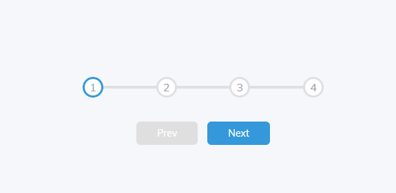

## Projeto 03 - Rotating Navigation 

## Projeto 04 - Hidden Search Widget 

## Projeto 05 - Blurry Loading 

## Projeto 06 - Scroll Animation 

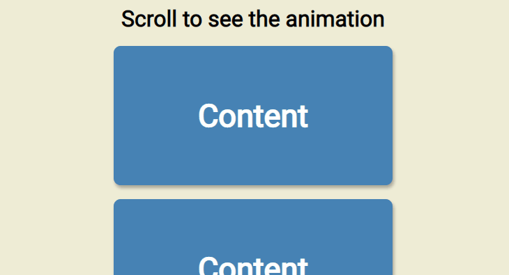

## Projeto 07 - Split Landing Page 

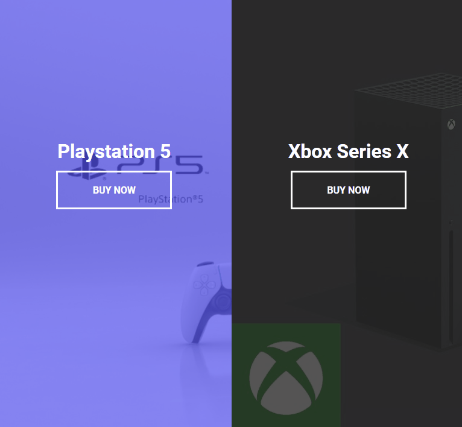

## Projeto 08 - Form Wave Animation 

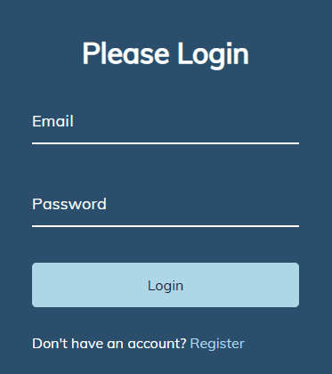

## Projeto 09 - Sound Board 

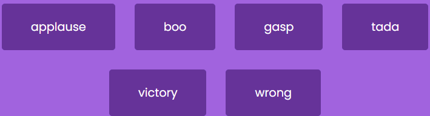

## Projeto 10 - Dad Jokes 

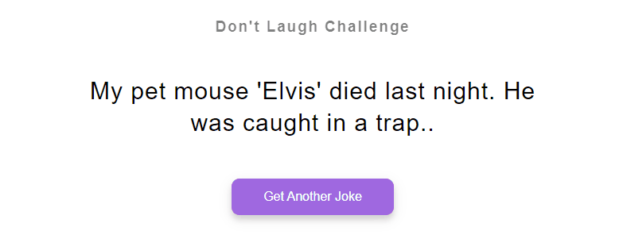

## Projeto 11 - Event KeyCodes 

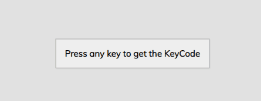

## Projeto 12 - FAQ Collapse 

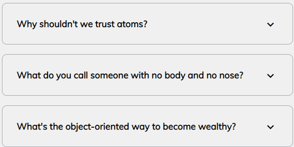

## Projeto 13 - Random Choice Picker 

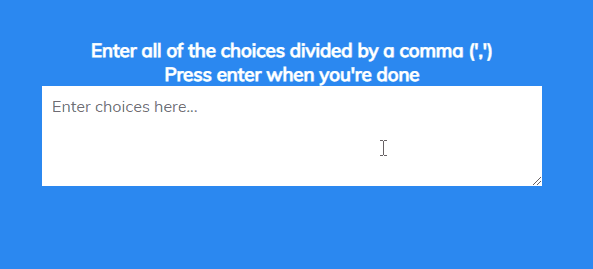

## Projeto 14 - Animated Navigation 

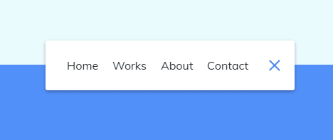

## Projeto 15 - Increment Counter 

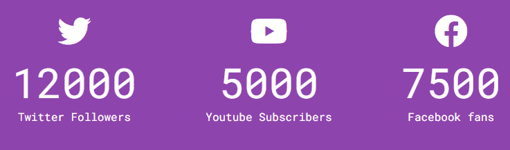

## Projeto 16 - Drink Water 

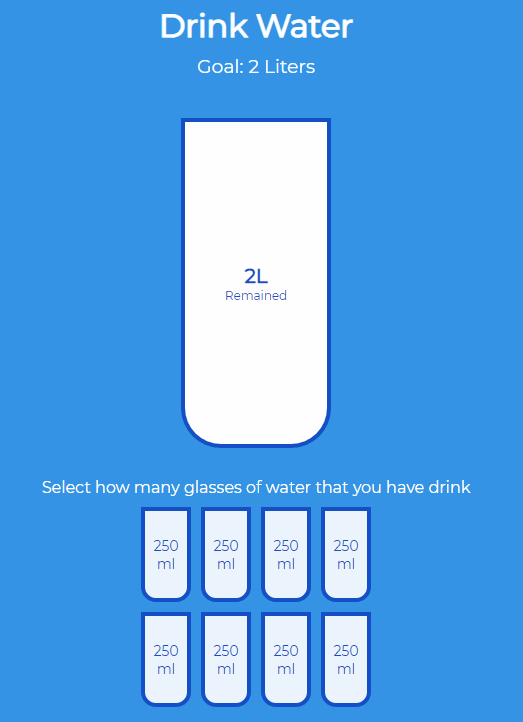

## Projeto 17 - Movie App 

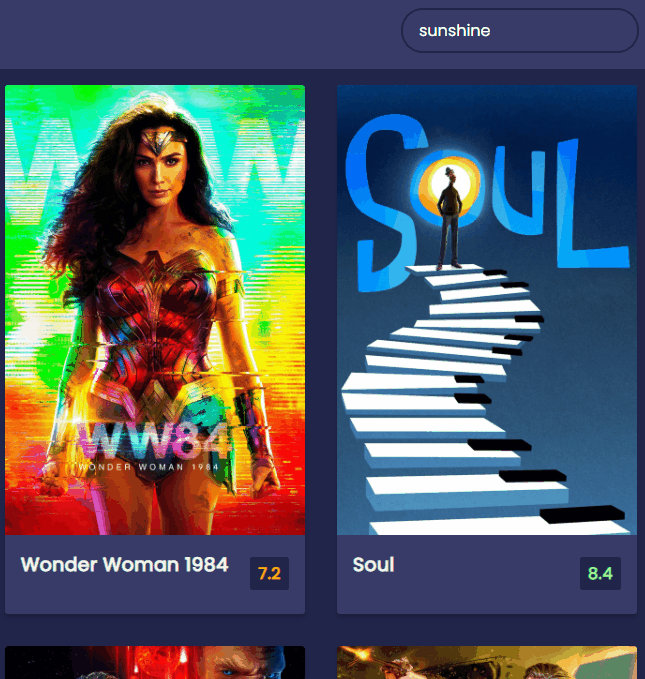

## Projeto 18 - Background Slider 

## Projeto 19 - Theme Clock 

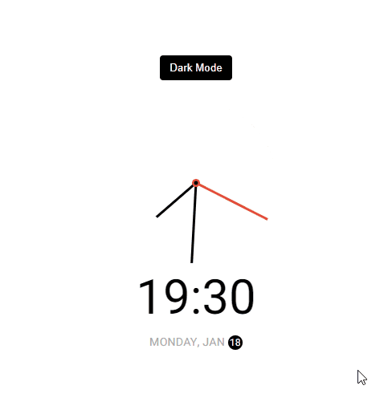

## Projeto 20 - Button Ripple Effect 

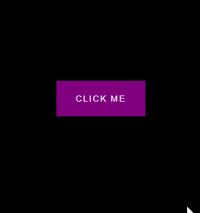

## Projeto 21 - Drag N Drop 

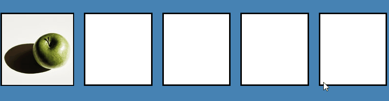

## Projeto 22 - Drawing App 

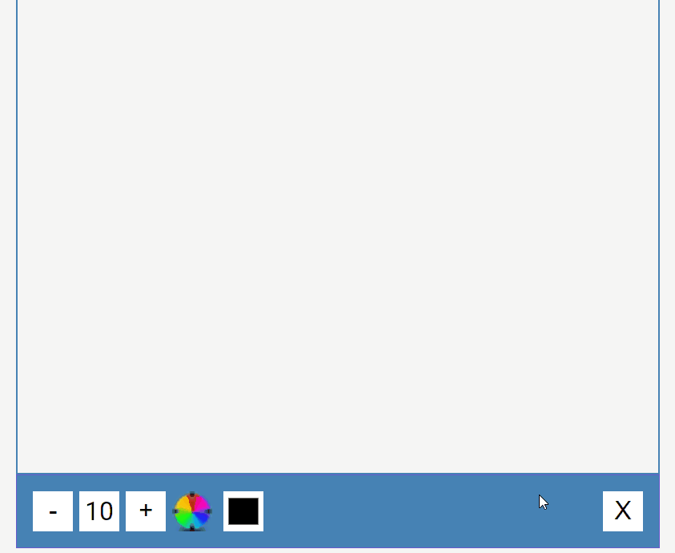

## Projeto 23 - Kinetic Loader 

## Projeto 24 - Content Placeholder 

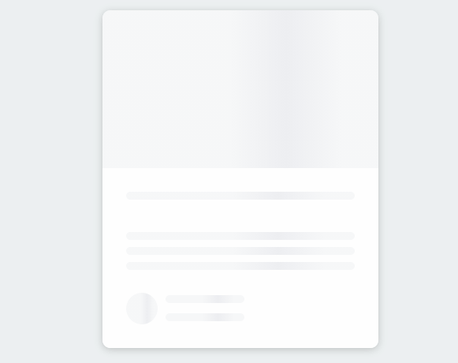

## Projeto 25 - Sticky Navbar 

## Projeto 26 - Vertical Slider 

## Projeto 27 - Toast Notification 

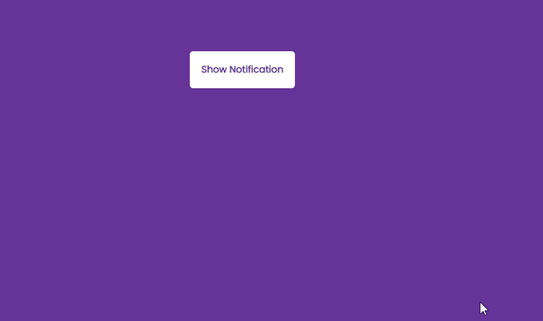

## Projeto 28 - Github Profiles 

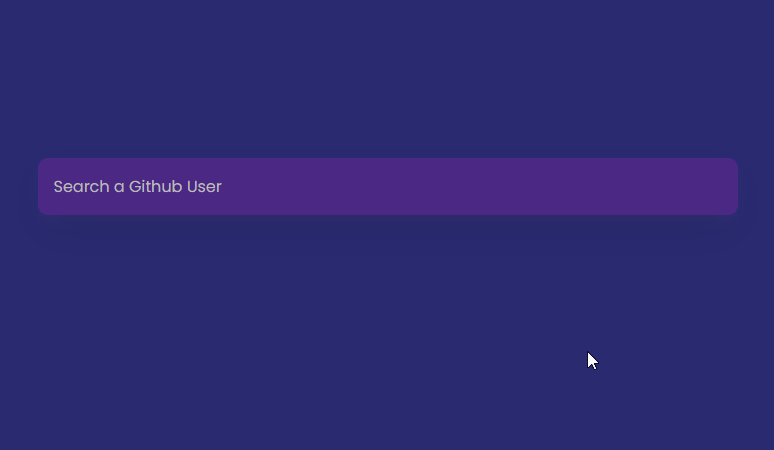
