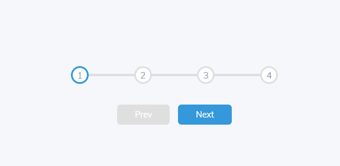

# Mini Web Projects

Mini projetos web utilizando apenas HTML, CSS E Vanilla JS

## Objetivos

Melhorar minhas skills em HTML, CSS e Vanilla JS por meio de pequenos projetos.

* [Projeto 01 - Expanding Cards](#id01)
* [Projeto 02 - Progress Steps](#id02)

## Projeto 01 - Expanding Cards 

## Projeto 02 - Progress Steps 

